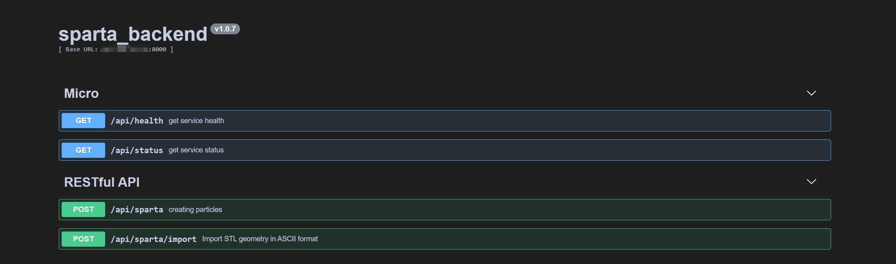

# Project Documentation

- Backend: Quickly build basic restful style API with `echo`.
- Network Server Framework: Implement data reception using the `gnet` network framework.
- API Documentation: Build automated documentation with `Swagger`.
- Configuration File: Parse configuration files using `viper`.
- CLI: Implement command line parameters with `cobra`.

## 1. Installation Instructions

- golang version >= v1.20

### 2. Source Code Compilation

```bash
# Using go.mod

# Install go dependency packages
go list (go mod tidy)

# Compile
./build.sh websocket websocket
```

### 2.2 Modify Configuration File

```bash
vim websocket.toml
```

### firewall

```bash
firewall-cmd --zone=public --add-port=8000/tcp --permanent
firewall-cmd --reload
# netstat -an | grep 8000
```

### third-party library

install cmake: version = 3.16.0

```bash
sudo yum remove cmake
```

```bash
wget https://github.com/Kitware/CMake/releases/download/v3.16.0/cmake-3.16.0.tar.gz
```

decompress

```bash
tar -zxvf cmake-3.16.0.tar.gz
```

make and install

```bash
cd cmake-3.16.0

./bootstrap
make
sudo make install

cmake --version
```

#### Ubuntu
```bash
apt install libopenmpi-dev
```

#### Centos
```bash
wget https://download.open-mpi.org/release/open-mpi/v3.1/openmpi-3.1.0.tar.gz
# or go to src pakcage
tar -zxvf openmpi-3.1.0.tar.gz

# install
cd openmpi-3.1.0/
./configure --prefix=/usr/local/openmpi
make -j 48
make install

# get info
whereis openmpi 
# openmpi: /usr/local/openmpi

# set env
source ~/.bashrc

# 添加路径
MYAPP=/usr/local/openmpi                                                          
# OPENMPI 3.1.6
export PATH=${MYAPP}/bin:$PATH
export LD_LIBRARY_PATH=${MYAPP}/lib:$LD_LIBRARY_PATH
export INCLUDE=${MYAPP}/include/:$INCLUDE
export CPATH=${MYAPP}/include/:$CPATH
export MANPATH=${MYAPP}/share/man:$MANPATH
```

### 2.3 Start

```bash
# Run
./websocket run
```

### view api 

```bash
http://localhost:8000/api/swagger
```

eg.:



request websocket： ws://localhost:8000/api/ws

#### The output is as follows：

```bash
SPARTA (13 Apr 2023)
Running on 1 MPI task(s)
Created orthogonal box = (-5 -5 -5) to (5 5 5)
Created 1000 child grid cells
  CPU time = 0.00297177 secs
  create/ghost percent = 57.981 42.019
Balance grid migrated 0 cells
  CPU time = 0.00145617 secs
  reassign/sort/migrate/ghost percent = 25.7127 1.05318 8.49537 64.7388
Reading surface file ...
  602 points
  1200 triangles
  -1 1 xlo xhi
  -1 1 ylo yhi
  -1 1 zlo zhi
  0.100631 min triangle edge length
  0.00439601 min triangle area
  32 0 = cells overlapping surfs, overlap cells with unmarked corner pts
  968 0 32 = cells outside/inside/overlapping surfs
  32 = surf cells with 1,2,etc splits
  995.861713454453 995.861713454453 = cell-wise and global flow volume
  CPU time = 0.407375 secs
  read/check/sort/surf2grid/ghost/inout/particle percent = 0.360998 1.0254 0.0390368 8.19112 90.3835 0.0904272 9.75046e-05
  surf2grid time = 0.0333686 secs
  map/comm1/comm2/comm3/comm4/split percent = 4.8971 2.01322 0.830313 0.428894 1.64338 89.5996
Creating particles ...
Created 9551 particles
  CPU time = 0.00749267 secs
WARNING: One or more fix inflow faces oppose streaming velocity (/xxx/src/sparta-13Apr2023/src/fix_emit_face.cpp:195)
Memory usage per proc in Mbytes:
  particles (ave,min,max) = 1.6875 1.6875 1.6875
  grid      (ave,min,max) = 1.66638 1.66638 1.66638
  surf      (ave,min,max) = 0.151062 0.151062 0.151062
  total     (ave,min,max) = 3.51257 3.51257 3.51257
Step CPU Np Natt Ncoll Nscoll c_max 
       0            0     9551        0        0        0           11 
     100   0.13060571     9560        1        1        2           20 
     200   0.29553304     9545        2        2        3           24 
     300   0.48495292     9723        3        3        1           30 
     400    0.6758407     9798        4        3        2           30 
     500   0.87547277     9908        6        5        0           33 
     600    1.0693094    10032        5        5        1           30 
     700    1.2874078     9996        4        4        0           26 
     800    1.5381838     9900        4        3        1           31 
     900    1.7528691     9880        6        6        1           28 
    1000    1.9551728     9902        4        3        2           29 
Loop time of 1.95518 on 1 procs for 1000 steps with 9902 particles

MPI task timing breakdown:
Section |  min time  |  avg time  |  max time  |%varavg| %total
---------------------------------------------------------------
Move    | 1.5366     | 1.5366     | 1.5366     |   0.0 | 78.59
Coll    | 0.22145    | 0.22145    | 0.22145    |   0.0 | 11.33
Sort    | 0.12458    | 0.12458    | 0.12458    |   0.0 |  6.37
Comm    | 0.0034114  | 0.0034114  | 0.0034114  |   0.0 |  0.17
Modify  | 0.064003   | 0.064003   | 0.064003   |   0.0 |  3.27
Output  | 0.0029384  | 0.0029384  | 0.0029384  |   0.0 |  0.15
Other   |            | 0.002226   |            |       |  0.11

Particle moves    = 9840342 (9.84M)
Cells touched     = 10097748 (10.1M)
Particle comms    = 0 (0K)
Boundary collides = 0 (0K)
Boundary exits    = 27428 (27.4K)
SurfColl checks   = 22610438 (22.6M)
SurfColl occurs   = 1400 (1.4K)
Surf reactions    = 0 (0K)
Collide attempts  = 144009 (0.144M)
Collide occurs    = 110469 (0.11M)
Gas reactions     = 0 (0K)
Particles stuck   = 0
Axisymm bad moves = 0

Particle-moves/CPUsec/proc: 5.03295e+06
Particle-moves/step: 9840.34
Cell-touches/particle/step: 1.02616
Particle comm iterations/step: 1
Particle fraction communicated: 0
Particle fraction colliding with boundary: 0
Particle fraction exiting boundary: 0.0027873
Surface-checks/particle/step: 2.29773
Surface-collisions/particle/step: 0.000142271
Surface-reactions/particle/step: 0
Collision-attempts/particle/step: 0.0146346
Collisions/particle/step: 0.0112261
Gas-reactions/particle/step: 0

Particles: 9902 ave 9902 max 9902 min
Histogram: 1 0 0 0 0 0 0 0 0 0
Cells:     1000 ave 1000 max 1000 min
Histogram: 1 0 0 0 0 0 0 0 0 0
GhostCell: 0 ave 0 max 0 min
Histogram: 1 0 0 0 0 0 0 0 0 0
EmptyCell: 0 ave 0 max 0 min
Histogram: 1 0 0 0 0 0 0 0 0 0
Surfs:     1200 ave 1200 max 1200 min
Histogram: 1 0 0 0 0 0 0 0 0 0
GhostSurf: 0 ave 0 max 0 min
Histogram: 1 0 0 0 0 0 0 0 0 0
WARNING: One or more fix inflow faces oppose streaming velocity (/xxx/src/sparta-13Apr2023/src/fix_emit_face.cpp:195)
Memory usage per proc in Mbytes:
  particles (ave,min,max) = 1.6875 1.6875 1.6875
  grid      (ave,min,max) = 1.66638 1.66638 1.66638
  surf      (ave,min,max) = 0.151062 0.151062 0.151062
  total     (ave,min,max) = 3.51257 3.51257 3.51257
Step CPU Np Natt Ncoll Nscoll c_max 
    1000            0     9902        4        3        0           29 
    1100   0.19659224     9920        5        5        1           29 
    1200   0.39655017    10046        5        5        3           28 
    1300   0.63425945     9945        5        5        0           28 
    1400   0.84268371    10042        4        4        1           28 
    1500    1.0254795    10019        5        5        3           30 
    1600    1.2178706    10070        5        5        0           29 
    1700    1.4145789    10120        2        2        0           26 
    1800    1.5863573    10011        2        2        0           27 
    1900    1.7781846     9846        1        1        4           27 
    2000    1.9548043     9791        3        3        2           26 
Loop time of 1.95482 on 1 procs for 1000 steps with 9791 particles

MPI task timing breakdown:
Section |  min time  |  avg time  |  max time  |%varavg| %total
---------------------------------------------------------------
Move    | 1.542      | 1.542      | 1.542      |   0.0 | 78.88
Coll    | 0.22429    | 0.22429    | 0.22429    |   0.0 | 11.47
Sort    | 0.11932    | 0.11932    | 0.11932    |   0.0 |  6.10
Comm    | 0.0032291  | 0.0032291  | 0.0032291  |   0.0 |  0.17
Modify  | 0.060898   | 0.060898   | 0.060898   |   0.0 |  3.12
Output  | 0.0030458  | 0.0030458  | 0.0030458  |   0.0 |  0.16
Other   |            | 0.002047   |            |       |  0.10

Particle moves    = 10014828 (10M)
Cells touched     = 10277594 (10.3M)
Particle comms    = 0 (0K)
Boundary collides = 0 (0K)
Boundary exits    = 27871 (27.9K)
SurfColl checks   = 23298852 (23.3M)
SurfColl occurs   = 1344 (1.34K)
Surf reactions    = 0 (0K)
Collide attempts  = 153491 (0.153M)
Collide occurs    = 117981 (0.118M)
Gas reactions     = 0 (0K)
Particles stuck   = 0
Axisymm bad moves = 0

Particle-moves/CPUsec/proc: 5.12316e+06
Particle-moves/step: 10014.8
Cell-touches/particle/step: 1.02624
Particle comm iterations/step: 1
Particle fraction communicated: 0
Particle fraction colliding with boundary: 0
Particle fraction exiting boundary: 0.00278297
Surface-checks/particle/step: 2.32644
Surface-collisions/particle/step: 0.000134201
Surface-reactions/particle/step: 0
Collision-attempts/particle/step: 0.0153264
Collisions/particle/step: 0.0117806
Gas-reactions/particle/step: 0

Particles: 9791 ave 9791 max 9791 min
Histogram: 1 0 0 0 0 0 0 0 0 0
Cells:     1000 ave 1000 max 1000 min
Histogram: 1 0 0 0 0 0 0 0 0 0
GhostCell: 0 ave 0 max 0 min
Histogram: 1 0 0 0 0 0 0 0 0 0
EmptyCell: 0 ave 0 max 0 min
Histogram: 1 0 0 0 0 0 0 0 0 0
Surfs:     1200 ave 1200 max 1200 min
Histogram: 1 0 0 0 0 0 0 0 0 0
GhostSurf: 0 ave 0 max 0 min
Histogram: 1 0 0 0 0 0 0 0 0 0

```

### 2.4 Docker Installation

```bash
# Create docker image
make

# Start
docker run -it --rm -p 8000:8000 --name websocket websocket:dev
```

## Env

To upgrade Python on CentOS 7:

1. check the current version of Python:

```bash
python --version
```

2. Install the Software Collections (SCL) repository:

```bash
sudo yum install centos-release-scl
```

3. install a newer version of Python (for example, Python 3.8):

```bash
sudo yum install rh-python38
```

4. After the installation, you need to enable the Python 3.8 environment:

```bash
scl enable rh-python38 bash
```

5. Now, if you check the Python version again, it should show the new version:

  ```bash
  python --version
  ```

  ```bash
  sudo yum install python-pip
  pip install --upgrade pip
  ```

install gnuplot
  
  ```bash
  sudo yum install gnuplot
  ```

install numpy
  
  ```bash
  pip install numpy
  ```

install vtk

  ```bash
  pip install vtk
  ```

install paraview

  ```bash
  yum install paraview
  ```

install mpi4py

  ```bash
  #sudo yum groupinstall 'Development Tools'
  #sudo yum install python-devel
  #yum install openmpi-devel
  # export CC=/usr/lib64/openmpi/bin/mpicc

  sudo yum install rh-python38-python-devel
  ```
  
  ```bash
  pip install mpi4py
  ```


## Error

ImportError: libSM.so.6: cannot open shared object file: No such file or directory

```bash
sudo yum install libSM
```

